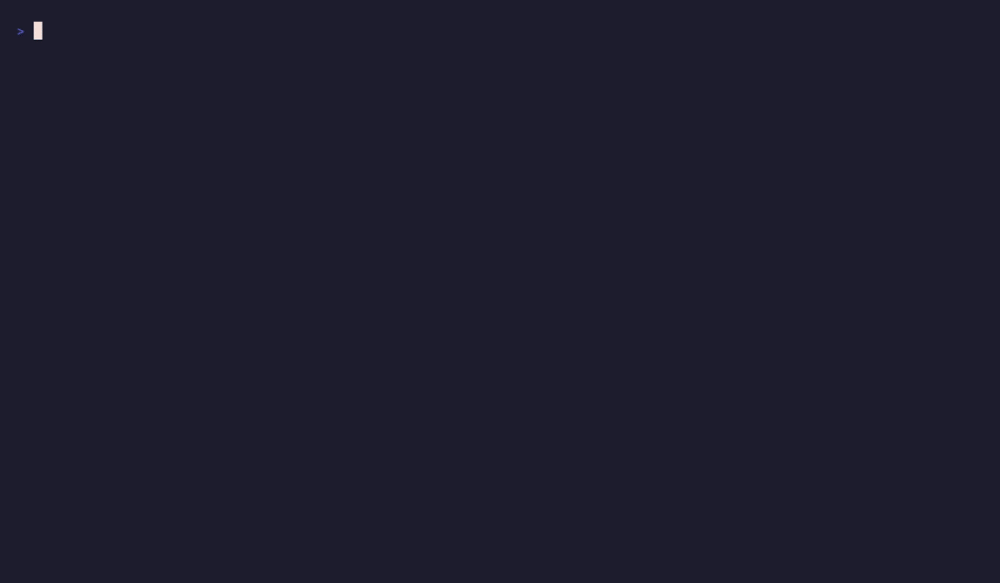

# aiquokka

One command to see the usage limits of all your AI coding subscriptions —
Claude, Codex, Kimi, and Grok — reading the credentials each official CLI
already stores. No tokens to paste, no config.



- **All in one place** — run `aiquokka` bare to see every provider at once.
- **Only what you use** — providers you aren't logged into are skipped silently.
- **Pace marker** — each bar shows where even, linear usage would put you right
  now, so you can tell at a glance if you're burning too fast.
- **Auto token refresh** — expired OAuth tokens are refreshed and written back.
- **Scriptable** — `--json` / `--yaml` for machine-readable output.

## Install

```sh
go install github.com/McKean/aiquokka@latest
```

Or build from source:

```sh
go build -o aiquokka .
```

## Usage

```sh
aiquokka           # all configured providers at once
aiquokka claude    # 5-hour and weekly limits
aiquokka codex     # weekly limit + remaining resets
aiquokka kimi      # 5-hour and weekly limits
aiquokka grok      # weekly usage limit + subscription tier
```

```
$ aiquokka claude
Claude  (max/default_claude_max_5x)
───────────────────────────────────
  5h       [██████░░░░░░░░░░░░░▒░░░░]  24.0%   resets in 33m (Mon 19:00)
  Weekly   [█▒░░░░░░░░░░░░░░░░░░░░░░]   3.0%   resets in 6d20h (Mon 15:00)
```

Run with no subcommand to fetch every provider concurrently. Providers you
aren't logged into are skipped, so you only see the ones you use; a provider
that *is* configured but errors is shown inline without aborting the rest.
Calling a provider directly (e.g. `aiquokka kimi`) always tells you if it isn't
set up.

### Machine-readable output

Add `--json` or `--yaml` (alias `--yml`) to any command. The aggregate view
keys the object by provider.

```
$ aiquokka grok --yml
provider: Grok
plan: XPremium
windows:
  - label: Weekly
    used_percent: 0
    resets_at: 2026-07-25T07:05:43.476608Z
extra:
  - label: Grok Code
    value: "yes"
```

## The pace marker

Every bar carries a bright-cyan marker cell at the point where **even, linear
usage** would put you at the current moment — the elapsed fraction of the
window. If the filled bar falls short of the marker you're under pace (headroom
to spare); if it's past the marker you're consuming faster than the window
refills.

```
  Weekly   [███████████▓███████████░]  94.0%   ← marker buried inside: way over pace
  5h       [████░░░░░░░░░░░░░░░░▒░░░]  16.0%   ← well behind the marker: plenty left
```

## How it works

aiquokka reuses the credentials each official CLI already stores on your
machine and queries the same usage endpoint that CLI uses.

| Command | Credentials | Endpoint |
| --- | --- | --- |
| `claude` | `~/.claude/.credentials.json` (OAuth) | `api.anthropic.com/api/oauth/usage` |
| `codex`  | `~/.codex/auth.json` (ChatGPT OAuth) | `chatgpt.com/backend-api/wham/usage` |
| `kimi`   | `~/.kimi-code` / `~/.kimi` OAuth, or `$KIMI_API_KEY` | `api.kimi.com/coding/v1/usages` |
| `grok`   | `~/.grok/auth.json` (xAI OIDC) | `cli-chat-proxy.grok.com/v1/billing?format=credits` |

Every provider that uses a short-lived OAuth access token (all except a static
Kimi key) **refreshes automatically** when the token has expired and writes the
new token back to the credential file.

Per-provider notes:

- **Codex** reports a weekly window plus your remaining *reset credits* ("amount
  of resets").
- **Kimi** limits are only on the Kimi Code coding subscription; the OAuth token
  is auto-detected from the CLI, or set `KIMI_API_KEY` to an `sk-kimi-…` key.
- **Grok** reports the weekly usage-limit window (the same figure the Grok CLI's
  `/usage` shows), plus subscription tier and Grok Code access. xAI rotates
  refresh tokens, so if both `grok` and `aiquokka` refresh the most recent one
  wins; a "run grok to re-login" message means the stored token was superseded.

### Not supported: Gemini / Antigravity

Antigravity (`agy`) authenticates as a *different* account than the classic
gemini-cli credentials, keeps its token in the OS keyring, and fetches its
grouped weekly quota from `daily-cloudcode-pa.googleapis.com` through a
first-party mechanism whose quota methods reject an externally-presented token
(HTTP 403). Those numbers can't be reproduced from outside the app without
capturing a live request, so no `gemini`/`antigravity` command is shipped.

## Caveats

These are all **undocumented** endpoints used by the respective official CLIs;
they may change without notice. Please don't poll them aggressively — Claude's
endpoint in particular rate-limits hard, so query no faster than once every few
minutes.

## License

[MIT](LICENSE)

