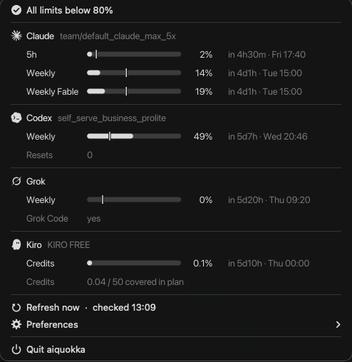

# aiquokka

One command to see the usage limits of all your AI coding subscriptions —
Claude, Codex, Kimi, Copilot, Grok, DeepSeek, Kiro, Antigravity, and Z.ai — reading the credentials each official CLI
already stores (or your existing API key). No tokens to paste, no config.


- **All in one place** — run `aiquokka` bare to see every provider at once.
- **Only what you use** — providers you aren't logged into are skipped silently.
- **Pace marker** — each bar shows where even, linear usage would put you right
  now, so you can tell at a glance if you're burning too fast.
- **Auto token refresh** — expired OAuth tokens are refreshed and written back.
- **Scriptable** — `--json` / `--yaml` for machine-readable output.
- **Live watch** — `--watch` / `-w` refreshes the view every 60 seconds.
- **Menu bar app** — `aiquokka tray` keeps your limits in the macOS menu bar or
  Linux system tray and alerts you before you hit them.

## Install

Download a prebuilt binary (no Go installation required):

```sh
curl -fsSL https://github.com/McKean/aiquokka/releases/latest/download/install.sh | sh
```

The installer detects Linux or macOS and Intel/AMD (`amd64`) or Apple Silicon/ARM
(`arm64`), verifies the release's SHA-256 checksum, and installs `aiquokka` into
`~/.local/bin`. macOS binaries require macOS 12 Monterey or newer, matching the
[Go 1.26 minimum requirements](https://go.dev/wiki/MinimumRequirements).
If needed, add that directory to your shell's `PATH`:

```sh
export PATH="$HOME/.local/bin:$PATH"
```

Run the same installer again to update. To select a version or destination:

```sh
curl -fsSL https://github.com/McKean/aiquokka/releases/latest/download/install.sh | VERSION=v2026.10.0 BIN_DIR="$HOME/.local/bin" sh
```

On Windows, run in PowerShell:

```powershell
irm https://github.com/McKean/aiquokka/releases/latest/download/install.ps1 | iex
```

The Windows installer supports AMD64 and ARM64, verifies SHA-256, installs into
`%LOCALAPPDATA%\aiquokka\bin`, and adds that directory to your user `PATH`.
Open a new terminal after installation. Set `$env:VERSION` or `$env:BIN_DIR`
before running the installer to customize it. Both installers accept
`AIQUOKKA_REPO=owner/repo` for releases hosted in a fork.

You can also download and extract an archive directly from
[GitHub Releases](https://github.com/McKean/aiquokka/releases).
These commands require a published release containing the installers and binaries.

To build from source, install Go 1.26.5 or newer and clone the repository:

```sh
git clone https://github.com/McKean/aiquokka.git
cd aiquokka
go build -o aiquokka .
```

On macOS, source builds also require Xcode Command Line Tools
(`xcode-select --install`) and CGO enabled. The published module revision with a local
`replace` directive cannot be installed using `go install ...@latest`.

### Release builds

The [release workflow](.github/workflows/release.yml) tests and builds Linux,
macOS, and Windows for AMD64 and ARM64. macOS builds use macOS runners with
CGO enabled; Linux and Windows binaries use `CGO_ENABLED=0`. Windows ARM64 is
cross-compiled on an AMD64 Windows runner; its runtime tests run on AMD64.

To publish, open **Actions → Build and release → Run workflow**, select `main`,
and leave the `tag` input empty. The workflow calculates a calendar version
`vYEAR.MONTH.COUNTER`, using the UTC year and month. The first release in a month
is `.0`; later releases increment the highest counter found in existing tags.
For example, `v2026.10.0` is followed by `v2026.10.1`, then `v2026.11.0` in November.
No version file needs updating. If that commit already has a calendar tag for
the current month, another run reuses it instead of creating a duplicate release.

All jobs use the same commit and version. After tests and all six builds pass,
the publication job creates the tag and publishes the archives, `checksums.txt`,
`install.sh`, and `install.ps1`. Publication runs are serialized to avoid assigning
the same counter concurrently. Pull requests and pushes to `main` run CI and
produce downloadable build artifacts; they do not publish automatically.

The publisher in [.github/scripts/release.py](.github/scripts/release.py) uses
Python's standard library, PyYAML for release notes, and the GitHub Releases API.
It verifies all six build
checksums, includes both installers in the final checksum manifest, and keeps a
new release as a draft until every asset has been uploaded. Repeating the
workflow reuses an existing release, skips unchanged assets, and replaces
matching assets when their contents differ. Immutable releases reject changed
assets.

To publish an existing tag manually, open **Actions → Build and release → Run
workflow**, select `main`, and enter the tag in the optional `tag` input.
Pushing a tag also starts publication. Existing SemVer tags remain supported;
prerelease tags such as `v2026.10.0-rc.1` publish prereleases. Every job checks
out the selected tag's commit, so the binary version and release match.
The tag must already exist on GitHub and contain this workflow and its scripts.
The workflow uses GitHub's built-in `GITHUB_TOKEN` with `contents: write` only
in the publication job; no personal token is needed. Publication runs for tag
pushes and manual release runs.

Describe each release in [releases/next.yaml](releases/next.yaml), without a
version field or a filename to rename:

```yaml
title: Faster and easier installs
highlights: |
  Install aiquokka without a Go toolchain.
features:
  - Prebuilt binaries for Linux, macOS, and Windows.
improvements:
  - Faster installation and updates.
fixes:
  - Updating an existing Windows installation works in PowerShell 5.1 and 7.
changes: []
breaking: []
```

The publisher renders the title, highlights, and nonempty sections into the
GitHub Release and adds a full changelog link. CI rejects invalid YAML, duplicate
or unknown keys, and empty notes. Edit the file before each release; its contents
are preserved in that release's tag. Optional `releases/<tag>.yaml` files take
precedence for a specific version. When `next.yaml` is unchanged from the
previous stable release, or no notes file exists, GitHub generates the notes
instead of repeating old highlights.

For a local archive, use Python 3 and Go:

```sh
python3 scripts/build-release.py v2026.10.0
python3 scripts/build-release.py v2026.10.0 --os linux --arch arm64
```

Archives and individual `.sha256` files are written to `dist/`. macOS builds
require a macOS host; both architectures can be built there. Release binaries
report their tag with `aiquokka --version`.

To validate the publisher and prepare a local release bundle without publishing:

```sh
python3 -m pip install -r .github/scripts/requirements.txt
python3 -m unittest discover -s .github/scripts -p 'test_*.py'
python3 .github/scripts/release.py --validate-notes
python3 .github/scripts/release.py --validate-tag v2026.10.0
python3 .github/scripts/release.py --prepare --release-dir dist
```

From a checkout of the release tag, `--dry-run` also verifies that `HEAD` matches
the tag and lists the assets without contacting GitHub:

```sh
RELEASE_TAG=v2026.10.0 GITHUB_REPOSITORY=McKean/aiquokka python3 .github/scripts/release.py --dry-run --release-dir dist
```

For a new calendar tag that does not exist yet, add `--create-tag` to the dry
run. It validates the bundle and notes and reports the planned tag without
creating it or contacting GitHub.

## Usage

```sh
aiquokka           # all configured providers at once
aiquokka claude    # 5-hour, weekly, and weekly Fable limits
aiquokka codex     # weekly limit + remaining resets
aiquokka kimi      # 5-hour and weekly limits
aiquokka grok      # weekly usage limit + subscription tier
aiquokka copilot   # copilot chat/completions limits
aiquokka deepseek  # account balance (remaining money)
aiquokka kiro      # Kiro CLI monthly credits and overage status
aiquokka agy       # daily antigravity limits
aiquokka zai       # Z.ai usage bundles and cash balance

aiquokka tray      # menu bar (macOS) / system tray (Linux) app

aiquokka --watch           # refresh all providers every 60s
aiquokka claude -w         # watch a single provider
```

```
$ aiquokka claude
Claude  (max/default_claude_max_5x)
───────────────────────────────────
  5h           [██████░░░░░░░░░░░░░░░▒░░]  24.0%   resets in 33m (Mon 19:00)
  Weekly       [███████████░░░▒░░░░░░░░░]  45.0%   resets in 2d20h (Thu 14:27)
  Weekly Fable [██████████████▓█░░░░░░░░]  67.0%   resets in 2d20h (Thu 14:27)
```

Fable draws from the same weekly pool and may take up to half of it, so it is
often the limit you hit first. The two bars move together: `Weekly Fable` at
100% puts `Weekly` at 50% or more.

Run with no subcommand to fetch every provider concurrently. In a terminal, a
fixed-order skeleton appears for the providers you use, then each section fills
in as its response arrives — you keep a stable order without waiting for the
slowest provider before seeing anything. Providers you aren't logged into are
skipped; a provider that *is* configured but errors is shown inline without
aborting the rest. Calling a provider directly (e.g. `aiquokka kimi`) always
tells you if it isn't set up.

### Watch mode

Pass `--watch` / `-w` on the root command or any provider subcommand to refresh
the view every 60 seconds until you hit Ctrl+C (or `q`). In a terminal a
pulsating status line shows the countdown to the next refresh; press **`r`** to
refresh immediately, or **`q`** (or Ctrl+C) to close. The previous frame is
cleared before each redraw. With `--json` / `--yaml` each tick emits a new
document (no status line).

### Menu bar / system tray

`aiquokka tray` (or `aiquokka bar`) runs aiquokka in the macOS menu bar or in
the Linux system tray. It checks your limits in the background and shows them
in a small menu, with the same data as the terminal view.

<p align="center">
  
</p>

- **Top bar** — a small ring and your highest usage right now (for example `44%`).
  If you only care about one provider, choose it in **Preferences** under
  **Menu bar shows** (or use `--pin claude`). Then the top bar shows that provider's logo
  and its highest usage, and the logo gets a small `!` when it reaches the
  alert level. The menu still shows all providers.
- **One table for all providers** (macOS) — each provider has its logo, and each window
  has a usage bar, the percent and the reset time. All bars start in the same
  column, so it is easy to compare them.
- **On Linux** — text rows with a small ring icon, because tray hosts there do
  not show wide images in menus. The usage rows are dimmed so they do not
  highlight on hover.
- **Usage pages** — click a provider's name to open its usage page in your
  browser.
- **Pace marker** — the small vertical line on a bar shows where even usage
  would put you now (see [The pace marker](#the-pace-marker)).
- **Alerts** — a desktop notification when a window reaches the alert level
  (default 80%), again when it reaches 100%, and when a window resets.
- **Preferences** — on macOS, **Preferences…** opens a small window with all
  options in one place: notifications, alert level, what the top bar shows and
  the refresh interval. Changes apply right away. On Linux the same options are
  in a submenu. aiquokka saves these choices in `tray.json` in your user config
  folder and uses them next time. Flags on the command line win over the saved
  choices.

```sh
aiquokka tray                  # refresh every 60s, alert at 80%
aiquokka tray --interval 2m    # refresh every 2 minutes (1m is the minimum)
aiquokka tray --threshold 90   # alert at 90%
aiquokka tray --notify=false   # no desktop notifications
aiquokka tray -p claude        # watch only one provider
aiquokka tray --pin claude     # watch all, but show only Claude in the top bar
```

Provider logos come from [LobeHub Icons](https://github.com/lobehub/lobe-icons)
(MIT). The logos are trademarks of their owners and are only used to show which
provider a row belongs to.

### Machine-readable output

Add `--json` or `--yaml` (alias `--yml`) to any command. The aggregate view
keys the object by provider.

```
$ aiquokka grok --yml
provider: Grok
plan: XPremium
windows:
  - label: Weekly
    used_percent: 0
    resets_at: 2026-07-25T07:05:43.476608Z
extra:
  - label: Grok Code
    value: "yes"
```

## The pace marker

Every bar carries a bright-cyan marker cell at the point where **even, linear
usage** would put you at the current moment — the elapsed fraction of the
window. If the filled bar falls short of the marker you're under pace (headroom
to spare); if it's past the marker you're consuming faster than the window
refills.

```
  Weekly   [███████████▓███████████░]  94.0%   ← marker buried inside: way over pace
  5h       [████░░░░░░░░░░░░░░░░▒░░░]  16.0%   ← well behind the marker: plenty left
```

## How it works

aiquokka reuses the credentials each official CLI already stores on your
machine and queries the same usage endpoint that CLI uses.

| Command | Credentials | Endpoint |
| --- | --- | --- |
| `claude` | `~/.claude/.credentials.json`, or macOS Keychain (OAuth) | `api.anthropic.com/api/oauth/usage` |
| `codex`  | `~/.codex/auth.json` (ChatGPT OAuth) | `chatgpt.com/backend-api/wham/usage` |
| `kimi`   | `~/.kimi-code` / `~/.kimi` OAuth, or `$KIMI_API_KEY` | `api.kimi.com/coding/v1/usages` |
| `grok`   | `~/.grok/auth.json` (xAI OIDC) | `cli-chat-proxy.grok.com/v1/billing?format=credits` |
| `copilot`| `~/.config/github-copilot/{apps,hosts}.json` | `api.github.com/copilot_internal/user` |
| `deepseek` | `$DEEPSEEK_API_KEY` | `api.deepseek.com/user/balance` |
| `kiro`   | Kiro CLI credential store (via `kiro-cli /usage`) | `q.<region>.amazonaws.com/getUsageLimits` |
| `agy`    | Antigravity CLI's own login | `agy -p /usage --output-format json` (no session needed, spends no quota) |
| `zai`    | `$ZAI_API_KEY`, or the zai provider in `~/.pi/agent/models.json` | `api.z.ai/api/biz/tokenAccounts/list/my`, `api.z.ai/api/biz/account/query-customer-account-report` |

Every provider that uses a short-lived OAuth access token (all except the
static API-key providers Kimi and DeepSeek) **refreshes automatically** when
the token has expired and writes the new token back to the credential file.

### Claude Code on macOS

Claude Code stores its OAuth credential in `~/.claude/.credentials.json` or,
on macOS, the Keychain. Aiquokka prefers the credentials file when it contains
an OAuth access token. Otherwise it reads the `Claude Code-credentials`
item through the macOS `security` tool (the same helper Claude Code uses to
write it), which avoids a Keychain permission dialog for the aiquokka binary.
Over SSH, unlock the login Keychain first with `security unlock-keychain`.
If a permission dialog still cannot be confirmed remotely, aiquokka times
out the Keychain read instead of hanging. When a refresh is required, it
updates that same item while preserving fields it does not own. If several
matching items exist, it prefers the current user's. This storage format is
an implementation detail of Claude Code and may change without notice.

Per-provider notes:

- **Codex** reports a weekly window plus your remaining *reset credits* ("amount
  of resets").
- **Kimi** limits are only on the Kimi Code coding subscription; the OAuth token
  is auto-detected from the CLI, or set `KIMI_API_KEY` to an `sk-kimi-…` key.
- **Grok** reports the weekly usage-limit window (the same figure the Grok CLI's
  `/usage` shows), plus subscription tier and Grok Code access. xAI rotates
  refresh tokens, so if both `grok` and `aiquokka` refresh the most recent one
  wins; a "run grok to re-login" message means the stored token was superseded.
- **Copilot** fetches usage across Chat, Completions, and Premium Interactions based on the IDE or GitHub CLI stored credential.
- **DeepSeek** reads `DEEPSEEK_API_KEY` (sk-…) and reports the account balance. The balance is money, not a usage limit, so the bar is full while any balance remains and empties at zero — the amount is the number that matters. The granted and topped-up portions are shown beneath it.
- **Kiro** runs the installed CLI’s built-in `/usage` command non-interactively, so Kiro retains ownership of credentials and token refresh. It reports monthly credits, plan, reset date, and overage status.
- **Antigravity** runs `agy -p "/usage" --output-format json`, which agy 1.2.x answers non-interactively without opening a session or spending quota. agy stays responsible for its credentials and token refresh.
- **Z.ai** reports the prepaid usage bundles (resource packages) as used/total token bars plus the pay-as-you-go cash balance. Bundles are model-specific — a bundle for `glm-5.3` stays untouched while requests to `glm-5.3-flash` burn cash — so check the "Applies to" fact if your cash drains faster than expected. The key is the Zhipu `{id}.{secret}` form; it is turned into a signed JWT locally. On the China platform, set `ZAI_BASE_URL=https://open.bigmodel.cn/api` (balance is then shown as CNY).

## Caveats

These are all **undocumented** endpoints used by the respective official CLIs;
they may change without notice. Please don't poll them aggressively — Claude's
endpoint in particular rate-limits hard. `--watch` refreshes every 60 seconds,
which is the floor you should use; avoid stacking extra watchers or shorter
custom loops on top of it.

## License

[MIT](LICENSE)
